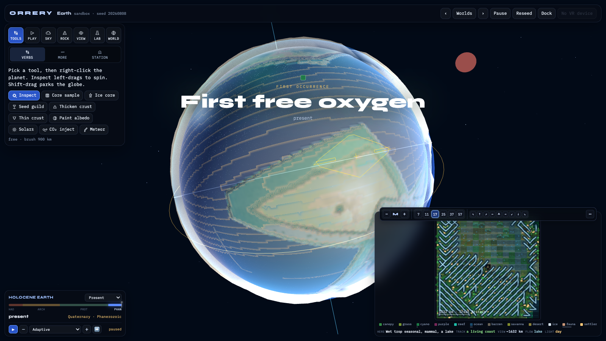
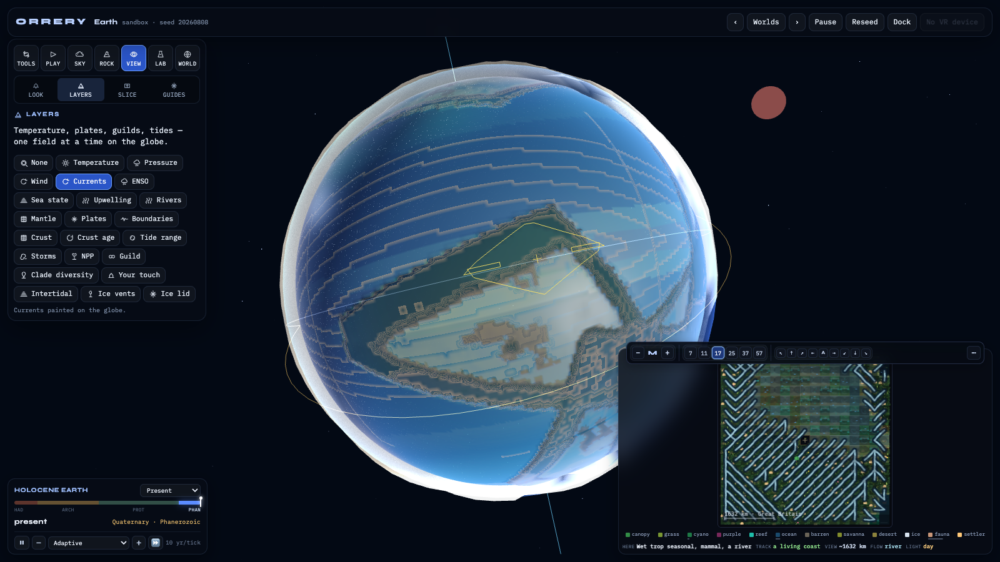
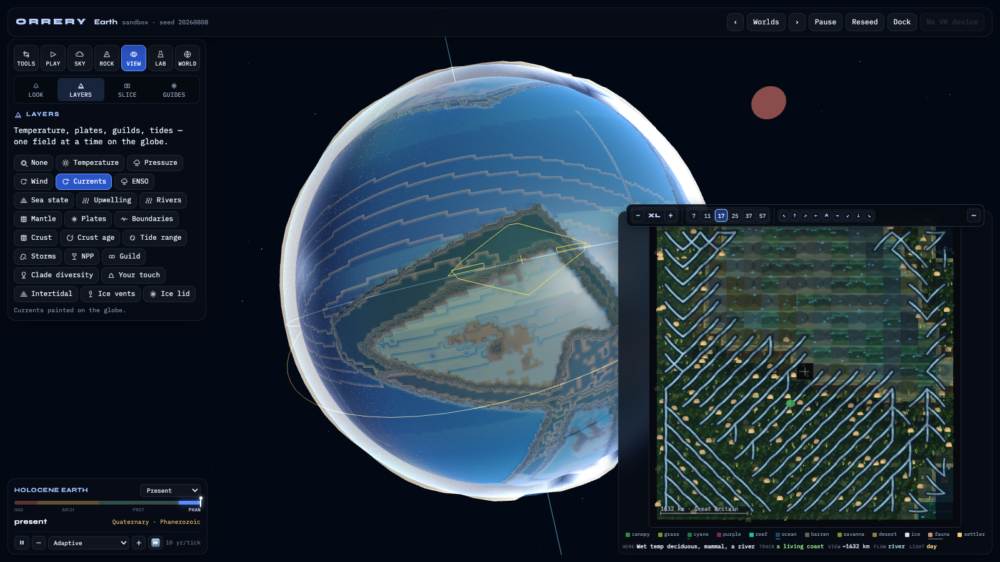
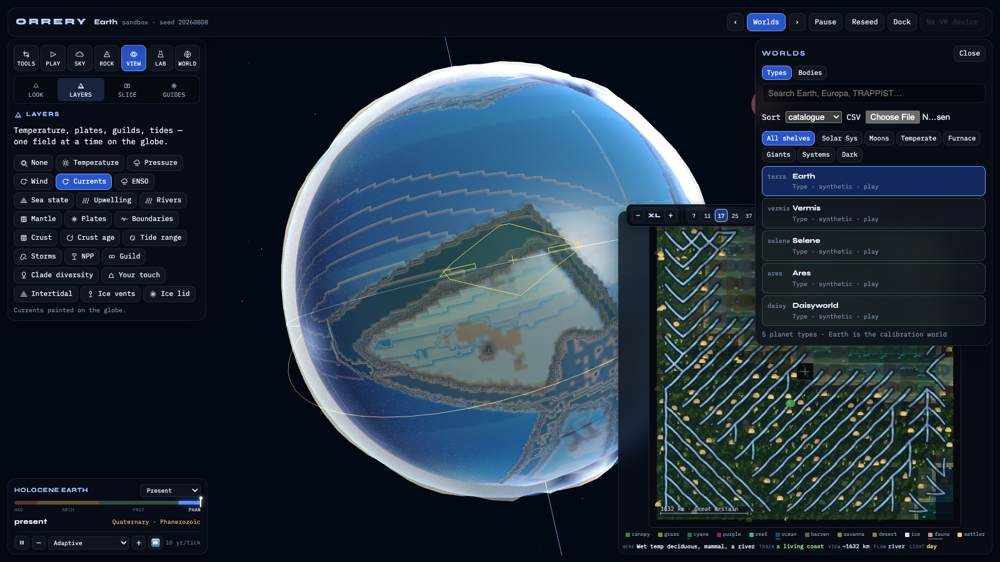

# ORRERY

Embodied god-game prototype: hold a planet, shrink, walk in.

[](https://mhsenkow.github.io/simearth/vr/)

[Open the live prototype](https://mhsenkow.github.io/simearth/vr/) — drag to spin, scroll to zoom. WebXR on a headset if you have one.

<p>


</p>

[](https://mhsenkow.github.io/simearth/vr/)

## Live

- [Pitch / site](https://mhsenkow.github.io/simearth/site/)
- [VR / WebGL prototype](https://mhsenkow.github.io/simearth/vr/)
- [Improvement backlog](https://mhsenkow.github.io/simearth/site/backlog.html)
- [Worlds backlog — 200 real planets and moons](https://mhsenkow.github.io/simearth/site/worlds.html)
- [Evolution & fidelity backlog — 200 ways to make evolution legible](https://mhsenkow.github.io/simearth/site/evolution.html)
- [God-game backlog — 200 ways to act like a god](https://mhsenkow.github.io/simearth/site/godgame.html)
- [The next 200 — what the last two backlogs left behind](https://mhsenkow.github.io/simearth/site/next.html)
- [Tides & weather — 200 items on the two systems you cannot see](https://mhsenkow.github.io/simearth/site/tides-weather.html)
- [Geology — 200 items on the mantle, the plates and the rock record](https://mhsenkow.github.io/simearth/site/geology.html)
- [Real parameters — 500 items to make every world match its measured values](https://mhsenkow.github.io/simearth/site/exoparams.html)
- [Alive — 300 items on whether it reads as a living world](https://mhsenkow.github.io/simearth/site/living.html)
- [Currents — 200 items on everything that is supposed to move](https://mhsenkow.github.io/simearth/site/currents.html)

## Local

```bash
python3 -m http.server 8765
# http://localhost:8765/vr/
```

WebXR needs HTTPS or localhost. Docs in `briefs/`.

## Backlogs

All ten backlogs are generated — edit the script, never the output.

```bash
node scripts/backlog.mjs        # briefs/backlog.md + site/backlog.html
node scripts/worlds.mjs         # briefs/worlds-backlog.md + site/worlds.html
node scripts/evolution.mjs      # briefs/evolution-backlog.md + site/evolution.html
node scripts/godgame.mjs        # briefs/godgame-backlog.md + site/godgame.html
node scripts/next.mjs           # briefs/next-backlog.md + site/next.html
node scripts/tides-weather.mjs  # briefs/tides-weather-backlog.md + site/tides-weather.html
node scripts/geology.mjs        # briefs/geology-backlog.md + site/geology.html
node scripts/exoparams.mjs      # briefs/exoparams-backlog.md + site/exoparams.html
node scripts/living.mjs         # briefs/living-backlog.md + site/living.html
node scripts/currents.mjs       # briefs/currents-backlog.md + site/currents.html
```

### Hand-written plans (not generated — edit these directly)

The biosphere rebuild has its own three-document set, because the evolution backlog says *what*
should be true and these say *why it is not yet* and *what to type*:

| Document | What it is |
|---|---|
| [`briefs/biosphere-audit.md`](briefs/biosphere-audit.md) | Measured evidence that deep-time evolution does not currently run — a 4.4 Gyr run reaches 25 lineages, zero transitions past LUCA, and O₂ = 0. Baselines, five root causes, and the perf wall at the 200-clade target. |
| [`briefs/biosphere-architecture.md`](briefs/biosphere-architecture.md) | The design: one source of truth, an evolvable body-plan module system (8 slots + 24 flags), state-gated transitions, affordance biases instead of scripted dates, and the presentation contract per zoom rung. |
| [`briefs/biosphere-plan.md`](briefs/biosphere-plan.md) | 437 numbered steps in six phases, 23 of them hard gates. Each step names a file, a symbol, and an acceptance test. |

Read them in that order. Start at plan step **P0-01**.

`living.mjs` is the only backlog that is not about being right. The eight before it made the
model correct; this one asks whether the thing on screen reads as a place where things are
happening. It is written around the product's own metaphor — a 3D planet you hold and a 2D
pixel map of one patch of it, at the same time — and its central finding is that **the flat map
costs like an animation and reads like a photograph**: `drawLocalView` runs from the render
loop, rebuilding a BFS patch and thousands of canvas stamps every frame, and draws the identical
image each time because every stamp is seeded from `hash2(c, 0x11fe)` — a hash with no time
term. Critical path: a presentation clock decoupled from the 10 kyr sim tick, persistent
individuals with real positions, one shared description of a cell consumed by both views, a
layered soundscape, a trace field, and a day phase.

`evolution.mjs` is the biosphere plan: how to rebuild life on a redox tower instead of an
eight-rung ladder, run it on a real geologic clock, let it evolve into a tree nobody authored,
and render the result well enough to believe.

`godgame.mjs` is the player-facing half of that: the manipulation grammar, consequence and
attribution, the economy of miracles, scenarios, embodiment, and the moral layer.

`next.mjs` is written against what those two left behind. The simulation and the god layer are
both built; this pass starts closing the gap on picture, machine, and audience: field textures
on the GPU, seeded RNG everywhere, golden-run tests, host stars as objects, morphology from
traits, and finale export.

Implemented systems under `vr/sim/`: `time`, `carbon`, `redox`, `evolve`, `ecology`,
`extinction`, `alien`, `instruments`, `meta`, `calibrate`, `rng`, `assert`, `star`,
`morphology`, `finale`, plus the god layer in `vr/sim/god/` — brush, receipts, thermo
economy, guild seeding, crust/plate sculpt, climate levers, disasters, genesis,
scenarios, observe, notice, shelf.

Lab tab exposes cores, Keeling/diversity sparklines, redox gauge, transit spectrum,
paper + save + finale export. **God** tab: guild picker, brush mask/snap, scenarios,
genesis, undo-the-act, FF→anomaly, let-it-run, shelf + seed string.

Climate fields (temp / moist / ice / clouds / wind) run on the **GPU** when float
framebuffers are available (`vr/sim/gpgpu/` — multi-slot, resident readback every 4th
tick). Bio, redox and phylogeny stay on the CPU; headless golden tests always use CPU climate.

Also in this layer: **runtime N**, multi-scatter clouds, ice-shell stack, XR hands,
orrery table, and a **Sky** dock tab — live tide/weather instruments with day, tilt,
season, and moon levers.

```bash
npm test --prefix vr          # pure helpers + golden run + Earth calibrate
npm run golden --prefix vr    # hash reproducibility only
node vr/sim/calibrate.mjs     # modern Earth tolerances
```

## Probes

Headless validation commands (run from repo root):

```bash
node vr/sim/test.mjs                              # unit + golden + calibrate
node vr/sim/headless.mjs --golden                 # field hash reproducibility
node vr/sim/calibrate.mjs                         # modern Earth tolerances
node vr/sim/deeptime.mjs --n=32 --ticks=500       # deep-time evolution probe
node vr/sim/deeptime.mjs --n=32 --ticks=4000 --seeds       # five-seed evolution gate
node vr/sim/deeptime.mjs --n=32 --ticks=5500 --every=500 --seed=20260808 --wall
node vr/sim/scale.mjs --lineages=250 --n=64       # phylogeny scale benchmark
```

Lab: overlay modes, PNG export of charts, Dual worker hash check, finale artefact, Earth
diversity comparison curves.

`tides-weather.mjs` is a focused batch on two systems with opposite problems. **Tides do not
exist** — `setMoon` issues a receipt reading "tides resume" and nothing does; there is no tidal
potential, no range field, no intertidal zone. **Weather is in the code and invisible on the
planet** — `computeWinds` prescribes three latitude bands scaled by `1 / rotationPeriod`, so spin
changes wind *speed* and never the *banding*, because with no pressure field there is nothing for
the circulation to be a solution to.

`geology.mjs` is a deep dive on the geosphere — the oldest and best-built system in the
codebase and the one extended least since. Plates get a random Euler pole rather than a
force, `plates.length` never changes so no ocean basin can close and the Wilson cycle
cannot run, every boundary is a Voronoi edge, and `rock` is one byte that gets overwritten.
The two roots are mantle convection and a real rock column; almost everything else is a
next layer on something that already works.

`exoparams.mjs` is the largest of the backlogs and the one about honesty. The catalogue names
120 real bodies; the seed parameter table in that script is now emitted to
[`vr/worldParams.js`](vr/worldParams.js) and consumed at runtime through
[`vr/sim/worldRecord.js`](vr/sim/worldRecord.js) — radius, mass, orbit, host, pressure and
albedo drive the ruleset instead of name-matching alone. Re-generate with
`node scripts/exoparams.mjs`. Refresh archive numbers with
`node scripts/fetch-exoarchive.mjs` (writes a committed snapshot under `vr/data/`).

Model boundaries: [`briefs/model-limits.md`](briefs/model-limits.md).
Calibrate Earth: `node vr/sim/calibrate.mjs`

`currents.mjs` is the fluid-dynamics pass — oceans, weather patterns, magma and moving rock.
Its finding is that **every fluid in the model is prescribed or absent, and all of them are
blocked behind one missing object**: there is no tangent frame, so `advect()` in `atmo.js`
assumes `NBR` indices 0/1 are east/west and 2/3 north/south, which is false on the ±Y faces.
Downstream of that: `ocean.js` has no velocity field at all, so there is no gyre and no Gulf
Stream; there are three unconnected AMOCs (`W.conveyor`, `W._amoc`, `W.thermohaline`) and the
tipping element reads the one that is written once as `?? 0.7`; `atmoTick` computes a wind field
with `computeWinds`, advects with it, and then `world.js` throws it away and calls
`geostrophicWind`; ENSO, Ekman and vorticity do not appear anywhere in `vr/`; and crustal
thickening lives only in `generateTectonics`, so two continents can converge for a billion
years without raising a metre of mountain. Critical path: `basis` → `advect2` → `oceanvel`
→ `gyre`/`moc` → `progatm` → `enso`, with `isostatick`/`orogen`/`magmachem` in parallel.

`worlds.mjs` carries the plan for turning the five invented rulesets into a catalogue
of real planets and moons. The in-app Worlds drawer lists playable bodies only;
engine and product items stay in [`briefs/worlds-backlog.md`](briefs/worlds-backlog.md).
Its figures come from the NASA Exoplanet Archive
`pscomppars` table; re-query it with:

```bash
node scripts/fetch-exoarchive.mjs
# or a one-off TAP sample:
curl -sG https://exoplanetarchive.ipac.caltech.edu/TAP/sync --data-urlencode "format=csv" --data-urlencode "query=select pl_name,pl_rade,pl_bmasse,pl_orbper,pl_orbeccen,pl_insol,pl_eqt,st_teff,st_spectype,sy_dist from pscomppars where pl_name like 'TRAPPIST-1%'"
```

This research has made use of the NASA Exoplanet Archive, which is operated by the
California Institute of Technology, under contract with the National Aeronautics and
Space Administration under the Exoplanet Exploration Program.